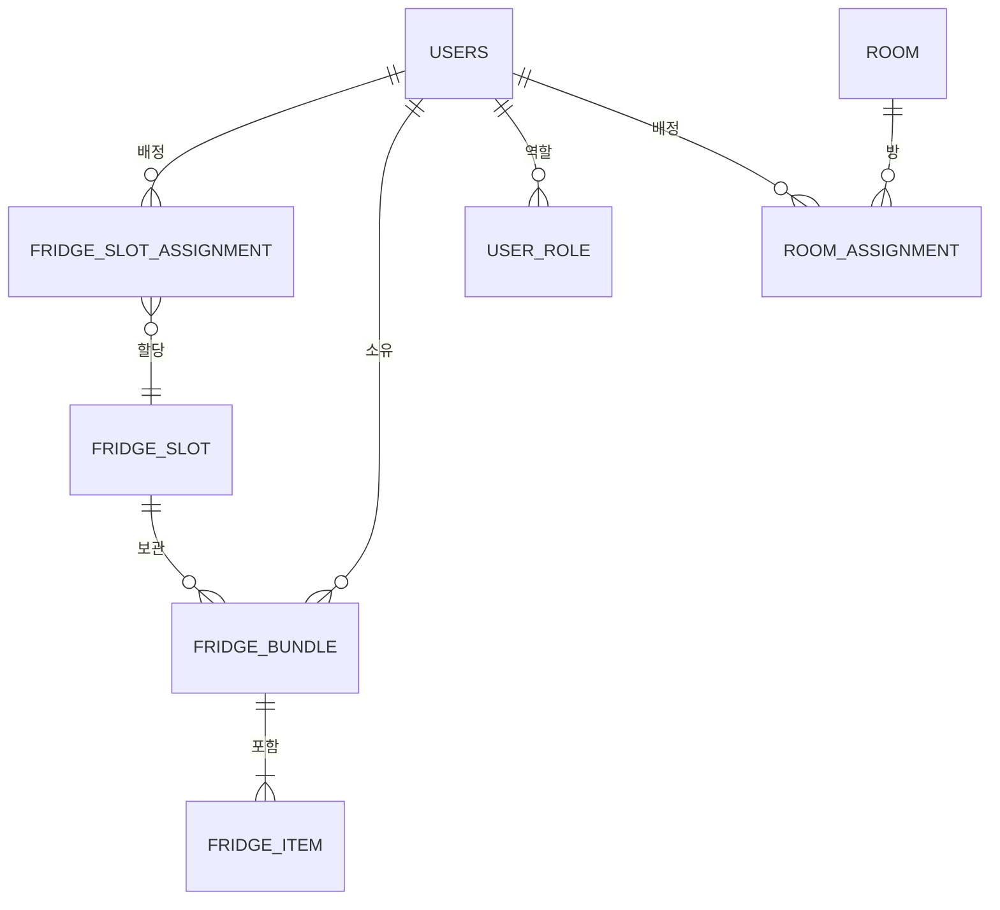

## 0. 고정 계약 (SSOT)
- 문서 기준: `docs/20_Deliverables/03_API_Specification.md`
- Endpoint: `GET /fridge/slots`
- Query: `floor`, `view`, `page`, `size`
- Response: `FridgeSlotListResponse`

---

## 1. 구현 목표 (고정 API 기준)
- OpenAPI 계약을 변경하지 않고 **슬롯 조회를 구현**한다.
- 프론트 호출 패턴(`view=full`, `size=200`)과 **호환되는 응답**을 보장한다.
- 역할/스코프/정합성 규칙을 **명시적으로 검증**한다.

---

## 2. 설계 흐름

### 2-1. 계약 확인
- 쿼리/응답 스키마를 그대로 사용한다.
- 중복처럼 보이는 필드도 삭제하지 않는다. (UI 편의 필드 포함)

### 2-2. 파라미터 정규화
- `floor`: 정수만 검증, 존재하지 않는 층이면 0건 반환
- `page`: 기본 0, 음수는 0
- `size`: 기본 20, 범위 1~200 클램프
- `view`: default `full`, unknown 값도 `full` 처리

### 2-3. 스코프 적용
- 거주자: 배정 슬롯만
- 층별장: 담당 층만
- 관리자: 전체 (필터 적용 시 해당 범위)

### 2-4. 응답 조립
- `Slot` 엔티티를 `FridgeSlotResponse`로 매핑
- `displayName`은 서버에서 계산 생성 (DB 컬럼 없음)
- `occupiedCount`는 활성 번들 기준 집계
- `locked`/`lockedUntil`/`slotStatus` 정합성 보장

---

## 3. 입력/출력 스펙

### 3-1. Request (Query)
- `floor`: Integer (optional)
- `view`: String (optional, default `full`)
- `page`: Integer (optional, default 0)
- `size`: Integer (optional, default 20, clamp 1~200)

### 3-2. Response
`FridgeSlotListResponse`
- `items`: `FridgeSlotResponse[]`
- `totalCount`, `page`, `size`, `totalPages`

`FridgeSlotResponse` 필드
- `slotId`, `slotIndex`, `slotLetter`
- `floorNo`, `floorCode`
- `compartmentType`, `resourceStatus`
- `slotStatus`, `locked`, `lockedUntil`
- `capacity`, `displayName`, `occupiedCount`

---

## 4. UI 편의 필드 해석
>중복을 허용해서, 프론트의 추가적인 작업을 방지한다.
- `floorNo` vs `floorCode`: 숫자 vs 표기 문자열
- `slotIndex` vs `slotLetter`: 내부 인덱스 vs 사용자 라벨
- `displayName`: 서버가 확정 제공하는 표시값

---

## 5. 검증 체크리스트 (실무 기준)

### 5-1. 파라미터
- [ ] `GET /fridge/slots` 기본 호출 → `view=full` 처리
- [ ] `view=weird` → full fallback
- [ ] `floor=999` → 200 + 빈 리스트
- [ ] `page=-1&size=999` → page=0, size=200 클램프

### 5-2. 스코프/권한
- [ ] 거주자: 본인 배정 슬롯만
- [ ] 층별장: 담당 층만
- [ ] 관리자: 전체 조회

### 5-3. 응답 정합성
- [ ] locked=true면 lockedUntil이 있어야 함
- [ ] `slotStatus=IN_INSPECTION` → `locked=true`
- [ ] `occupiedCount <= capacity`

---

## 6. 구현 체크리스트 (순서)
- [ ] Repository: 스코프/층/배정 쿼리 준비
- [ ] Service: 파라미터 정규화 + 스코프 적용
- [ ] Mapper: `FridgeSlotResponse` 매핑
- [ ] Controller: `GET /fridge/slots` 연결

---

## 7. DB 상세 설계 (Phase 1 기준 초안)

### 7-0. ERD (확장 반영)
> **Note:** 초기 5개 테이블(USERS/FRIDGE_SLOT/FRIDGE_BUNDLE/FRIDGE_ITEM/FRIDGE_SLOT_ASSIGNMENT)만으로 시작하려 했으나,  
> API 스펙의 `roles`, `primaryRoom`, `room/roomCode/personalNo` 요구사항을 충족하기 위해  
> `USER_ROLE`, `ROOM_ASSIGNMENT`, `ROOM`을 추가 설계하였다.

### 7-1. 핵심 테이블

**FRIDGE_SLOT**
- `id` (PK, UUID)
- `slot_index` (INT)
- `slot_letter` (VARCHAR)
- `floor_no` (INT)
- `compartment_type` (VARCHAR)
- `resource_status` (VARCHAR)
- `slot_status` (VARCHAR: ACTIVE/LOCKED/IN_INSPECTION)
- `locked_until` (DATETIME, nullable)
- `capacity` (INT)
- `created_at`, `updated_at`
- 인덱스: `(floor_no)`, `(compartment_type)`, `(slot_status)`
- 제약: `capacity > 0`

**FRIDGE_BUNDLE**
- `id` (PK, UUID)
- `slot_id` (FK → FRIDGE_SLOT.id)
- `owner_id` (FK → USERS.id)
- `status` (VARCHAR)
- `created_at`, `updated_at`, `deleted_at`
- 인덱스: `(slot_id, status)`, `(owner_id, status)`

**FRIDGE_ITEM**
- `id` (PK, UUID)
- `bundle_id` (FK → FRIDGE_BUNDLE.id)
- `name` (VARCHAR)
- `expiry_date` (DATE, nullable)
- `quantity` (INT, nullable)
- `unit_code` (VARCHAR, nullable)
- `created_at`, `updated_at`, `removed_at`
- 인덱스: `(bundle_id)`, `(expiry_date)`

**USERS**
- `id` (PK, UUID)
- `login_id` (VARCHAR)
- `display_name` (VARCHAR)
- `status` (VARCHAR)
- `last_login_at` (DATETIME, nullable)
- `created_at`, `updated_at`
- 인덱스: `(login_id)`, `(status)`
- 제약: `login_id` 유니크, `status` NOT NULL

**USER_ROLE**
- `id` (PK, UUID)
- `user_id` (FK → USERS.id)
- `role` (VARCHAR: RESIDENT/FLOOR_MANAGER/ADMIN)
- 인덱스: `(user_id)`, `(role)`
- 제약: `(user_id, role)` 유니크

**ROOM_ASSIGNMENT**
- `id` (PK, UUID)
- `user_id` (FK → USERS.id)
- `room_id` (UUID, nullable)
- `floor` (INT)
- `room_number` (VARCHAR)
- `personal_no` (INT)
- `assigned_at` (DATETIME)
- 인덱스: `(user_id)`, `(floor)`, `(room_number)`
- 제약: `(user_id, room_id)` 유니크 (활성 배정용이면 released_at 추가 고려)

**ROOM**
- `id` (PK, UUID)
- `floor` (INT)
- `room_number` (VARCHAR)
- 인덱스: `(floor)`, `(room_number)`
- 제약: `(floor, room_number)` 유니크

**FRIDGE_SLOT_ASSIGNMENT**
- `id` (PK, UUID)
- `user_id` (FK → USERS.id)
- `slot_id` (FK → FRIDGE_SLOT.id)
- `assigned_at` (DATETIME)
- `released_at` (DATETIME, nullable)
- `status` (VARCHAR, optional)
- 유니크 제약: 활성 배정 1건 보장 (예: `(user_id, slot_id, released_at)` 기준)
- 인덱스: `(user_id, released_at)`, `(slot_id, released_at)`

### 7-2. 관계 요약
- USERS 1:N FRIDGE_BUNDLE
- FRIDGE_SLOT 1:N FRIDGE_BUNDLE
- FRIDGE_BUNDLE 1:N FRIDGE_ITEM
- USERS N:M FRIDGE_SLOT → FRIDGE_SLOT_ASSIGNMENT 조인 테이블

### 7-3. 조회 계산 필드
- `occupied_count`: `FRIDGE_BUNDLE` 중 `status=active` 집계
- `locked`: `slot_status`/`locked_until` 기준 계산
- 배정 스코프: `FRIDGE_SLOT_ASSIGNMENT`에서 `released_at IS NULL` 기준 필터

---

## 8. 문서 반영
- [ ] API 변경 시 `docs/20_Deliverables/03_API_Specification.md` 업데이트
- [ ] 스키마 변경 시 `docs/20_Deliverables/02_ERD_&_Schema.md` 업데이트

### Troubleshooting Log
> 기술적 이슈는 `Troubleshooting/` 폴더에 별도 파일로 생성 후 여기에 링크를 거세요.

- [[../Troubleshooting/폴더구조는 어떻게 할까]]
- [사용자 필드 설계(최소 vs 필수)](../Troubleshooting/사용자%20필드%20설계(최소%20vs%20필수).md)
