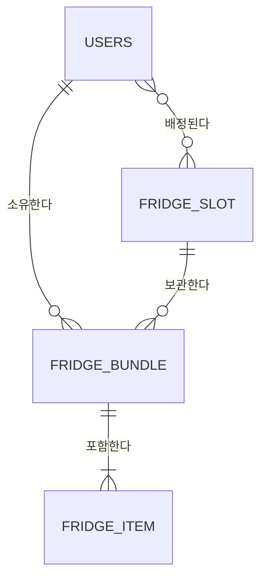

> **Summary:** 물품관리
* 포장/물품 CRUD (등록/조회/수정/삭제)
* 목록/상세/등록/수정 화면 중심
* 간단 검색: 포장명 기준
## 1. 🏗️ [Step 1] 계약 및 뼈대 설계 (Contract First)

**목표:** 세부 컬럼은 나중으로 미루고, **API 계약(DTO)**과 **엔티티 관계(Relationship)**를 먼저 정의합니다.

| **Method** | **URI**                          | **설명**                                                  | **핵심 Entity** |
| ---------- | -------------------------------- | ------------------------------------------------------- | ------------- |
| GET        | /fridge/slots                    | 칸 목록 조회(필터: floor, view, page, size)                    | Slot          |
| GET        | /fridge/bundles                  | 포장 목록 조회(필터: slotId, owner, status, search, page, size) | bundle, owner |
| POST       | /fridge/bundles                  | 포장 생성(허용량 초과 시 422 CAPACITY_EXCEEDED)                   | bundle       |
| GET        | /fridge/bundles/{bundleId}       | 포장 상세 조회                                                | bundle        |
| PATCH      | /fridge/bundles/{bundleId}       | 포장 수정                                                   | bundle        |
| DELETE     | /fridge/bundles/{bundleId}       | 포장 삭제                                                   | bundle        |
| POST       | /fridge/bundles/{bundleId}/items | 포장에 물품 추가                                               | item          |
| PATCH      | /fridge/items/{itemId}           | 물품 수정                                                   | item          |
| DELETE     | /fridge/items/{itemId}           | 물품 삭제                                                   | item          |

> API URL에서 발견된 핵심 리소스
- **테이블 후보 1:** slots
- **테이블 후보 2:** bundles (포장)
- **테이블 후보 3:** items (포장안의 개별물품)
- 테이블 후보 4: user (사용자)
	- api 필터에 사용자가 있으므로
### 1-2. 도메인 관계 스케치 (ERD)

> **Focus:** 필드(컬럼)는 생략하고, **URL 경로 분석**을 통해 부모-자식 관계(`||--o{`)만 선을 긋습니다.

[보관하다]
- 냉장고칸은 번들이 없거나, 번들 여러개를 보관하다.
- 번들은 단 1개의 냉장고칸에 보관된다.
[포함하다]
- 번들은 아이템이 최소 1개는 있어야 하고, 여러개도 포함한다.
- 아이템은 단 1개의 번들에 포함된다.
[소유하다]
- 사용자는 0개 혹은 여러개의 번들을 소유한다.
- 번들은 1명의 사용자에게 속한다
[배정한다]
- 냉장고칸은 0명 혹은 여러명의 유저들에게 배정된다.
- 사용자는 0개 혹은 여러개의 냉장고칸에 배정받는다

### 1-3. 기초 공사 (Skeleton Code)

> **Check:** 실제 코딩을 시작합니다. 단, **필드 없이 `@Id`와 `연관관계`만 작성**합니다.

- [ ] `domain/entity` 패키지 클래스 생성 완료
- [ ] **Relationship:** `@ManyToOne`, `@OneToMany` 어노테이션 매핑 완료
- [ ] **Repo:** 기본 `JpaRepository` 인터페이스 생성 완료

## 2. 🧩 [Step 2] Task 분담 (Breakdown)

**목표:** 의존성(부모 데이터 우선)과 개발난이도를 고려하여 작업을 나눈다.
- **Task 1 — 기반 조회(난이도 하)**
	- 목적: 슬롯/칸 데이터가 있어야 번들 생성/조회가 가능
- **Task 2 — 번들 목록/생성(난이도 중)**
	- 이유: 핵심 플로우 진입점, 용량/권한/잠금 같은 정책 검증이 여기서 시작됨
- **Task 3 — (난이도 중)**
	- 이유: 단건 조회 및 변경 로직은 목록/생성과 분리하는 게 테스트가 쉬움
- **Task 4 — (난이도 중~상)**
	- 이유: 번들 의존 + 아이템 생명주기, 만료/수량 정책 포함 가능성

| **상태** | **작업명 (Link)**                                                           | **주요 내용**                                                                                                     |                                                                |
| ------ | ------------------------------------------------------------------------ | ------------------------------------------------------------------------------------------------------------- | -------------------------------------------------------------- |
| 완료     | [Task_개발환경구축](../../10_Workspace/Tasks/Task_개발환경구축.md)                   | 개발환경을 구축한다.                                                                                                   |                                                                |
| `진행`   | [Task_Slot 조회 및 검증](../../10_Workspace/Tasks/Task_Slot%20조회%20및%20검증.md) | - GET /fridge/slots                                                                                           |                                                                |
|        | Bundle 생성/조회                                                             | - GET /fridge/bundles POST /fridge/bundles                                                               | - `Bundle` 생성 시 `Slot`의 현재 점유량을 `count`하는 로직 구현.               |
|        | 번들 상세/수정/삭제                                                              | - GET /fridge/bundles/{bundleId} PATCH /fridge/bundles/{bundleId} DELETE /fridge/bundles/{bundleId} |                                                                |
|        | 아이템 추가/수정/삭제                                                             | - POST /fridge/bundles/{bundleId}/items PATCH /fridge/items/{itemId} DELETE /fridge/items/{itemId}  | 실제 삭제 대신 `removedAt` 업데이트  포장 삭제 시 내부 물품(`Item`)들도 함께 처리되는지 |

---

## 3. ✅ [Step 4] 검증 및 마감 (Closing)

**목표:** [Step 3] 구현(Task 파일 내부에서 진행)이 완료된 후, 전체 페이즈를 마무리합니다.

### 3-1. 통합 테스트 (Verification)

- [ ] **Postman:** 모든 API가 계약된 JSON 포맷대로 응답하는가?
- [ ] **DB Check:** 부모-자식 관계(FK)가 정상적으로 연결되어 저장되었는가?

### 3-2. 산출물 박제 (Deliverables)

- [ ] **API Spec:** `20_Deliverables/03_API_Specification.md` 최신화 (실제 구현 반영)
- [ ] **ERD:** `20_Deliverables/02_ERD_&_Schema.md` 업데이트 (추가된 컬럼 반영)
- [ ] **Decision:** 면접용 주요 의사결정을 `20_Deliverables/04_Tech_Decisions.md`에 기록했는가?
- [ ] **Log:** 트러블슈팅을 `Troubleshooting/` 폴더에 기록했는가?

---

## 📝 4. 주요 이슈 메모 (Phase Log)

- (예: 개발 중 Slot의 타입을 Enum으로 변경하기로 결정함)
- (예: Bundle 삭제 시 Item도 같이 삭제되는 Cascade 설정 적용)
