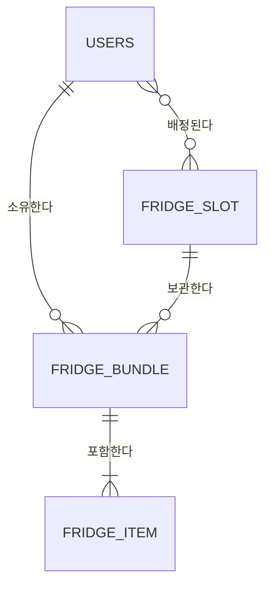

## 1. 🎯 목표
> **Summary:** 물품관리
* 포장/물품 CRUD (등록/조회/수정/삭제)
* 목록/상세/등록/수정 화면 중심
* 간단 검색: 포장명 기준

## 2. 📋 구현 대상 API
> **OpenAPI 스펙 원본**

- [ ] GET /fridge/slots — 칸 목록 조회(필터: floor, view, page, size)
- [ ] GET /fridge/bundles — 포장 목록 조회(필터: slotId, owner, status, search, page, size)
- [ ] POST /fridge/bundles — 포장 생성(허용량 초과 시 422 CAPACITY_EXCEEDED)
- [ ] GET /fridge/bundles/{bundleId} — 포장 상세 조회
- [ ] PATCH /fridge/bundles/{bundleId} — 포장 수정
- [ ] DELETE /fridge/bundles/{bundleId} — 포장 삭제
- [ ] POST /fridge/bundles/{bundleId}/items — 포장에 물품 추가
- [ ] PATCH /fridge/items/{itemId} — 물품 수정
- [ ] DELETE /fridge/items/{itemId} — 물품 삭제

## 3. 🏗️ 도메인 뼈대 설계
> **핵심:** 세부 컬럼은 나중으로 미루고, 엔티티 간의 **'관계(Relationship)'**를 정의하는 데 집중합니다.

### (1) 핵심 명사 (Entities)
> API URL에서 발견된 핵심 리소스

- **테이블 후보 1:** slots
- **테이블 후보 2:** bundles (포장)
- **테이블 후보 3:** items (포장안의 개별물품)
- 테이블 후보 4: user (사용자)
	- api 필터에 사용자가 있으므로

### (2) 관계도 스케치 (ERD)
> Mermaid 문법을 사용하여 데이터의 흐름과 소속 관계를 가시화합니다

[보관하다]
- 냉장고칸은 번들이 없거나, 번들 여러개를 보관하다.
- 번들은 단 1개의 냉장고칸에 보관된다.
[포함하다]
- 번들은 아이템이 최소 1개는 있어야 하고, 여러개도 포함한다.
- 아이템은 단 1개의 번들에 포함된다.
[소유하다]
- 사용자는 0개 혹은 여러개의 번들을 소유한다.
- 번들은 1명의 사용자에게 속한다
[배정한다]
- 냉장고칸은 0명 혹은 여러명의 유저들에게 배정된다.
- 사용자는 0개 혹은 여러개의 냉장고칸에 배정받는다

### (3) 기초 공사 (Skeleton Code)

> **Action:** 코딩 시작 전, 아래의 껍데기 클래스를 먼저 생성하여 컴파일 에러를 방지합니다. (컬럼 없이 관계만 설정)

- [ ] **Entity Class:** `@Entity` 클래스들 생성 (필드 없이 `@Id`만)
- [ ] **Relationship:** `@ManyToOne`, `@OneToMany` 등 연관관계 어노테이션 매핑 완료

---
## 4. 🧩 Task 분담 (Breakdown)
> **Strategy:** API 간의 의존성과 개발 난이도를 고려하여 작업을 나눕니다.

| 작업                                                                                                              |
| --------------------------------------------------------------------------------------------------------------- |
| [Task_개발환경구축](Tasks/Task_개발환경구축.md)                                                                             |
| [Task_냉장고 칸을 조회하고, 그곳에 포장을 등록하여 저장되는지 확인한다.](Tasks/Task_냉장고%20칸을%20조회하고,%20그곳에%20포장을%20등록하여%20저장되는지%20확인한다..md) |
task의 1마다 하단 붙여넣기
#### 📦 Goal: 생성된 포장 안에 실제 내용물(Item)을 채워 넣고 관리한다 : 물품(Item) 상세 관리

- **구현 API:**
    - `POST /fridge/bundles/{bundleId}/items` (물품 추가)
    - `PATCH /fridge/items/{itemId}` (물품 정보/유통기한 수정)
    - `DELETE /fridge/items/{itemId}` (물품 삭제)
- **Key Point:**
    - `FridgeItem` 테이블 생성 및 `Bundle`과 연관관계 매핑.
    - 물품 추가/삭제 시 `Bundle`의 상태(신선도 등) 변화 고려.
        

#### 🧹 [[Task_03_Bundle_Maintenance]] : 포장 수정 및 삭제

> Goal: 포장 정보를 수정하거나, 필요 없어진 포장을 정리한다.
>
> Difficulty: ⭐ (단순 CRUD)

- **구현 API:**
    - `PATCH /fridge/bundles/{bundleId}` (메모, 이름 수정)
    - `DELETE /fridge/bundles/{bundleId}` (포장 삭제)
- **Key Point:**
    - **Soft Delete** (실제 삭제 대신 `removedAt` 업데이트) 적용 여부 결정.
    - 포장 삭제 시 내부 물품(`Item`)들도 함께 처리되는지(Cascade) 확인.
### 포장/물품 조회 (필수)

| 작업                                     |
| -------------------------------------- |
| Task_목록/상세 화면 데이터 조합 기준 정리 (정렬/페이징 보류) |
| Task_등록/수정 화면 입력 검증 규칙 정리              |

## 선택 검색 기능

| 작업                               |
| -------------------------------- |
| Task_간단 검색(포장명) 적용 지점 및 결과 규칙 정리 |
## 5. 📦 최종 산출물 (Deliverables)

> **Definition of Done:** 모든 Task가 끝났을 때 최신화해야 할 문서

- [ ] **API Spec:** `20_Deliverables/03_API_Specification.md` 업데이트 완료
- [ ] **ERD:** `20_Deliverables/02_ERD_&_Schema.md` 최신화 완료
- [ ] **Decision Log:** 주요 의사결정을 `20_Deliverables/04_Tech_Decisions.md`에 한 줄 기록했는가?
- [ ] **Issue Highlight:** 중요한 트러블슈팅은 `20_Deliverables/05_Issue_Highlights.md`에 요약했는가?

### 화면 흐름과 요구사항을 기반으로 엔드포인트와 필드명을 확정합니다.

**1) 엔드포인트(Endpoint) 개념 힌트**

- 리소스는 무엇이고, 동작은 무엇인가요?
	- 우리가 관리하고 싶은 대상인 리소스는 냉장고칸, 포장, 물품
	- 동작은 crud, 조회, 동작이다.
- 리소스의 “집합”과 “단일 항목”을 어떻게 구분할까요?
- “포장 안에 물품”이라는 관계는 URL 구조에 어떻게 표현하는 게 자연스러울까요?

**2) 필드명(Field) 설계 힌트**

- 화면에서 실제로 보여줘야 하는 데이터(목록/상세/수정 화면)를 먼저 적어볼까요?
- 사용자가 입력하는 값과 서버가 계산해주는 값은 어떻게 구분할까요?
- 동일한 의미를 가진 필드가 여러 화면에 나오면 이름을 통일할지, 뷰 전용 이름을 둘지 어떤 기준으로 결정할까요?

**3) 제약(Constraints) 정의 힌트**

- 필수값/선택값은 무엇이며, 누락되면 어떤 에러가 적절할까요?
- 길이 제한, 날짜 형식, 숫자 범위 같은 검증 규칙은 UI 입력과 서버 검증을 어떻게 맞출까요?
- 권한/소유권 제약(본인 포장만 수정/삭제)은 어떤 요청에서 반드시 체크돼야 할까요?
