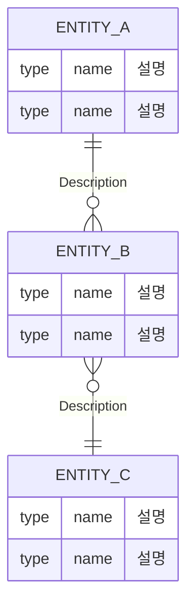

# 🚩 Phase 4 관리자 기능
> *"운영 조회 중심의 관리자 기능"*
* 전체 물품 조회/검색/삭제
* 검사 이력 조회, 역할 관리## 1. 🎯 목표 (Goal)
> **Summary:** 이번 페이즈에서 달성해야 할 핵심 가치
- (예: 사용자가 빈 냉장고 칸을 조회하고, 자신의 포장(Bundle)을 등록할 수 있다.)
- (예: 포장 내의 물품을 개별적으로 관리한다.)

## 1. 🎯 목표 (Goal)

> **Summary:** 이번 페이즈가 완료되었을 때, 사용자나 시스템이 얻게 되는 핵심 가치는 무엇인가요?

- (예: 시스템의 기초가 되는 유저 및 권한 체계를 완성한다.)
- (예: 외부 API와의 연동을 통해 실시간 데이터를 확보한다.)

---

## 2. 📋 구현 대상 API (Scope)

> **Source:** OpenAPI 스펙 또는 요구사항 정의서에서 이번 페이즈에 구현할 범위를 확정합니다.

- [ ] (예시)GET /fridge/slots — 칸 목록 조회
- [ ] METHOD /path : API 간단 설명
- [ ] METHOD /path : API 간단 설명

---

## 3. 🏗️ 도메인 뼈대 설계 (Domain Skeleton)

> **핵심:** 세부 컬럼은 나중으로 미루고, 엔티티 간의 **'관계(Relationship)'**를 정의하는 데 집중합니다.

### (1) 핵심 엔티티 (Entities)

> API 리소스를 분석하여 필요한 테이블 명사들을 추출합니다.

- **Entity A:** (핵심 주체)
- **Entity B:** (소속된 주체)
- **Entity C:** (관계 연결을 위한 매개체)

### (2) 관계도 스케치 (ERD)

> Mermaid 문법을 사용하여 데이터의 흐름과 소속 관계를 가시화합니다.

### (3) 기초 공사 (Skeleton Code)

> **Action:** 코딩 시작 전, 아래의 껍데기 클래스를 먼저 생성하여 컴파일 에러를 방지합니다. (컬럼 없이 관계만 설정)

- [ ] **Entity Class:** `@Entity` 클래스들 생성 (필드 없이 `@Id`만)
- [ ] **Relationship:** `@ManyToOne`, `@OneToMany` 등 연관관계 어노테이션 매핑 완료
    

---

## 4. 🧩 Task 분담 (Breakdown Strategy)

> **Division:** API들을 성격에 따라 2~3개의 Task로 그룹화합니다.

|**Task ID**|**작업 범위 (Target API)**|**중점 사항**|
|---|---|---|
|**[[Task_XX_01]]**|생성 및 기초 조회 API|데이터 저장 및 기본 연관관계 검증|
|**[[Task_XX_02]]**|상세 가공 및 복합 조회 API|필터링 로직, 계산 필드(`dDay` 등) 구현|
|**[[Task_XX_03]]**|수정/삭제 및 예외 처리|데이터 정합성 유지 및 삭제 정책(Cascade)|

---

## 5. 📦 최종 산출물 (Deliverables)

> **Definition of Done:** 모든 Task가 끝났을 때 최신화해야 할 문서

- [ ] **API Spec:** `20_Deliverables/03_API_Specification.md` 업데이트 완료
- [ ] **ERD:** `20_Deliverables/02_ERD_&_Schema.md` 최신화 완료
- [ ] **Decision Log:** 주요 의사결정을 `20_Deliverables/04_Tech_Decisions.md`에 한 줄 기록했는가?
- [ ] **Issue Highlight:** 중요한 트러블슈팅은 `20_Deliverables/05_Issue_Highlights.md`에 요약했는가?
