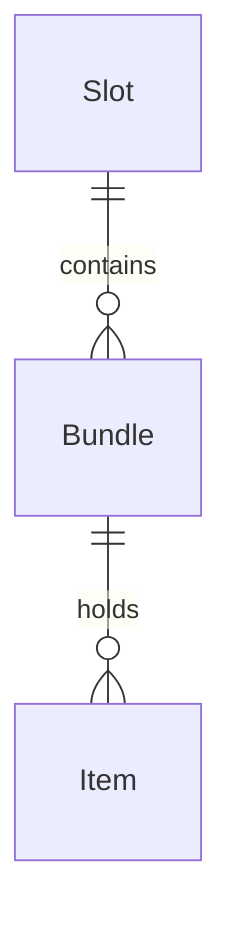

# 🚩 Phase 5 알림 유틸리티
> *"푸시 이전 단계: 알림 저장/읽음 처리"*
* 알림 저장/읽음 처리 (Push는 2차 확장)

**Summary:** `이번 페이즈가 완료되었을 때, 사용자나 시스템이 얻게 되는 핵심 가치를 쓰자 (예: 외부 API와의 연동을 통해 실시간 데이터를 확보한다.)`
- (상세기능
## 1. 🏗️ [Step 1] 계약 및 뼈대 설계 (Contract First)

**목표:** 세부 컬럼은 나중으로 미루고, **API 계약(DTO)**과 **엔티티 관계(Relationship)**를 먼저 정의합니다.

### 1-1. 구현 대상 API 및 계약 (Scope)

> **Action:** OpenAPI/UI를 분석하여 이번 페이즈의 구현 범위를 확정합니다.

| **Method** | **URI**           | **설명**     | **핵심 Entity** |
| ---------- | ----------------- | ---------- | ------------- |
| `POST`     | `/fridge/bundles` | `꾸러미 생성`   | `Bundle`      |
| `GET`      | `/fridge/slots`   | `슬롯 목록 조회` | `Slot`        |
| …          | …                 | …          | …             |

### 1-2. 도메인 관계 스케치 (ERD)

> **Focus:** 필드(컬럼)는 생략하고, **URL 경로 분석**을 통해 부모-자식 관계(`||--o{`)만 선을 긋습니다.

### 1-3. 기초 공사 (Skeleton Code)

> **Check:** 실제 코딩을 시작합니다. 단, **필드 없이 `@Id`와 `연관관계`만 작성**합니다.

- [ ] `domain/entity` 패키지 클래스 생성 완료
- [ ] **Relationship:** `@ManyToOne`, `@OneToMany` 어노테이션 매핑 완료
- [ ] **Repo:** 기본 `JpaRepository` 인터페이스 생성 완료
    

---

## 2. 🧩 [Step 2] Task 분담 (Breakdown)

**목표:** 의존성(부모 데이터 우선)을 고려하여 2~3개의 작업 단위로 쪼갭니다.

| **상태** | **작업명 (Link)**        | **주요 내용**              |
| ------ | --------------------- | ---------------------- |
| `진행`   | `**기초 데이터 (Parent)**` | `Slot 조회 및 검증`         |
|        | `**핵심 기능 (Core)**`    | `Bundle 생성/조회 (DTO매핑)` |
|        | `**상세/유틸 (Detail)**`  | `Item 관리 및 수정`         |

---

## 3. ✅ [Step 4] 검증 및 마감 (Closing)

**목표:** [Step 3] 구현(Task 파일 내부에서 진행)이 완료된 후, 전체 페이즈를 마무리합니다.

### 3-1. 통합 테스트 (Verification)

- [ ] **Postman:** 모든 API가 계약된 JSON 포맷대로 응답하는가?
- [ ] **DB Check:** 부모-자식 관계(FK)가 정상적으로 연결되어 저장되었는가?

### 3-2. 산출물 박제 (Deliverables)

- [ ] **API Spec:** `20_Deliverables/03_API_Specification.md` 최신화 (실제 구현 반영)
- [ ] **ERD:** `20_Deliverables/02_ERD_&_Schema.md` 업데이트 (추가된 컬럼 반영)
- [ ] **Decision:** 면접용 주요 의사결정을 `20_Deliverables/04_Tech_Decisions.md`에 기록했는가?
- [ ] **Log:** 트러블슈팅을 `Troubleshooting/` 폴더에 기록했는가?

---

## 📝 4. 주요 이슈 메모 (Phase Log)

- (예: 개발 중 Slot의 타입을 Enum으로 변경하기로 결정함)
- (예: Bundle 삭제 시 Item도 같이 삭제되는 Cascade 설정 적용)
