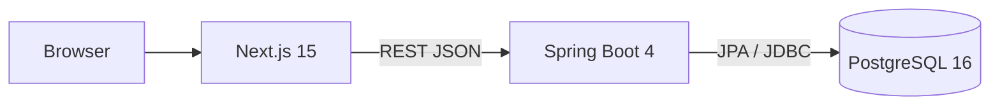

# System Architecture

> 현재 저장소에서 확인된 구성과 후속 학습 후보를 구분한다. 후보 기술을 현재 사용 중인 구성처럼 표시하지 않는다.

## 1. 구성과 목표 연결



| Component | Current role | Status |
| --- | --- | --- |
| Next.js | 기존 UI·UX와 API Client | Existing |
| Spring Boot | Rebuild 대상 REST API | Skeleton / In Progress |
| Spring Data JPA | 영속성 접근 | Existing |
| PostgreSQL | 로컬·테스트 DB, 배포 대상 저장소 | Local / Deployment planned |
| Docker Compose | 로컬 실행 환경 | Existing |

위 연결도는 목표 통합 흐름이며 업무 API의 실제 연동 완료를 의미하지 않는다.
MVP 인증은 Spring Security 서버 세션과 CSRF로 확정됐지만 백엔드는 구현 전이다.
프론트 전환 상태는 [Frontend Integration Baseline](../10_Workspace/Frontend_Integration_Baseline.md),
배포와 확장 범위는 [README](../../README.md)를 따른다.

## 2. Request Lifecycle

```text
HTTP 요청
→ Controller: 바인딩·입력 검증
→ Service: 권한·소유권·상태 검증과 트랜잭션
→ Repository: 필요한 데이터 조회·저장
→ DTO 매핑
→ HTTP 응답
```

- Entity와 API DTO는 분리한다.
- Repository 구현은 Spring Data JPA와 명시적 쿼리부터 검토한다.
- 데이터 무결성은 애플리케이션 검증과 DB 제약조건을 함께 사용한다.
- 수직 슬라이스에 필요한 모델과 쿼리만 추가한다.

## 3. Current Development Decisions

### Schema Management

- 현재 개발 환경은 `spring.jpa.hibernate.ddl-auto=update`를 사용한다.
- 초기 모델 탐색을 위한 임시 설정이며 배포용 스키마 관리 전략으로 간주하지 않는다.
- 핵심 MVP 스키마가 안정되면 Flyway 초기 마이그레이션을 작성하고 `ddl-auto=validate`로 전환한다.
- 테스트 DB에서도 운영과 동일한 마이그레이션을 재현하는 것을 목표로 한다.

### DTO Mapping

- MVP에서는 MapStruct 없이 명시적인 수동 매핑을 사용한다.
- Entity와 API DTO, 계산 필드와 권한별 응답 차이를 직접 드러낸다.
- 반복 매핑이 실제 유지보수 문제로 확인되면 자동 매핑 도구를 재검토한다.

### Local Reproducibility

- Docker Compose로 프론트엔드, 백엔드와 PostgreSQL 실행 조건을 재현한다.
- PostgreSQL 버전, 환경 변수와 서비스 연결을 코드로 관리한다.
- Docker Compose 선택은 클라우드 또는 운영 배포 환경 선택과 별개의 결정이다.

## 4. Candidate Architecture

다음 기술은 확정 구성이나 현재 의존성이 아니다.

| Candidate | Trigger | 먼저 검증할 방법 |
| --- | --- | --- |
| Redis Session | 세션 인증 확정 후 재시작·다중 서버에서 세션 공유 필요 | 단일 서버 세션 요구와 배포 구조 확인 |
| Redis Lock | 다중 인스턴스에서 DB 락만으로 검사 동시성을 해결하기 어려움 | 유일성 제약, 조건부 갱신, 낙관적·비관적 락 |
| QueryDSL | 검색 조건 조합이 복잡해지고 쿼리 유지보수가 어려움 | Query Method, JPQL, Specification |
| Flyway | 핵심 스키마가 안정되고 변경 이력 재현이 필요 | 현재 스키마와 초기 마이그레이션 기준 확정 |
| SSE | 여러 냉장고 담당자의 실시간 검사 합류를 구현 | 폴링 기반 MVP와 동시성 정책 검증 |
| GitHub Actions | 로컬 검증 명령이 안정되고 반복 자동화가 필요 | 재현 가능한 테스트·lint·build 기준선 |

## 5. 기술 확장 원칙

[README의 이후 확장 원칙](../../README.md#이후-확장-원칙)을 따른다.
Redis 비교는 필수 과제가 아니다. DB 방식의 한계나 구체적인 학습 목적이 확인되고
사용자가 선택할 때만 별도 Task로 다룬다. Flyway와 CI는 1차 완료를 위해 준비할
항목이지만 현재 적용됐다는 의미는 아니다.

## 6. 검증 상태

실행 환경과 과거·최근 검증 결과는 [Phase 0](../10_Workspace/🚩%20Phase%200%20개발%20기준선.md)에서
관리한다. 현재 API별 완료 여부는 API 구현 현황을 따른다. 이 문서의 목표 구조나
설계 결정만으로 배포·인증·마이그레이션 구현 완료를 판단하지 않는다.
