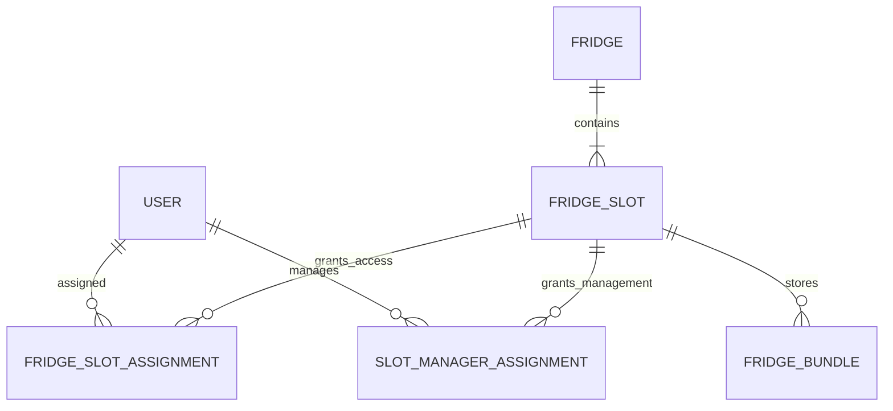

# ERD & Schema

> Status: Incremental Draft
> Current scope: `GET /fridge/slots`

전체 도메인을 먼저 확정하지 않는다. 사용자와 수직 슬라이스에 필요한 모델·생명주기·제약을 설계한 뒤 이 문서를 점진적으로 확장한다.

## 1. 현재 모델 범위

| Model | Status | 이번 범위의 책임 |
| --- | --- | --- |
| `User` | Partial | 조회 주체 식별 |
| `Fridge` | Draft | Slot이 소속된 물리적 냉장고와 설치 층 |
| `FridgeSlot` | Draft | Slot 메타데이터·상태·용량 |
| `FridgeSlotAssignment` | Draft | 사용자의 현재 Slot 배정 |
| `SlotManagerAssignment` | Draft | 냉장고 담당자의 현재 Slot 관리 배정 |
| `FridgeBundle` | Partial | 활성 포장 수 집계를 위한 Slot 참조와 삭제 상태 |

`Partial`과 `Draft`는 전체 도메인 모델이 확정됐다는 의미가 아니다. 실제 JPA 매핑과 마이그레이션은 Task 설계·테스트와 함께 확정한다.

## 2. Slot 수직 슬라이스의 논리 스키마

### USER

현재 Task에서는 사용자 식별자와 계정 자체에 부여되는 관리자 권한의 경계만
필요하다. 인증 자격증명과 프로필 필드는 인증 수직 슬라이스에서 확정한다.
거주 자격과 냉장고 담당자 여부는 단일 User 역할 값이 아니라 활성 업무 배정으로 조회한다.

| Column | Constraint | Status |
| --- | --- | --- |
| `id` | PK, UUID | Existing skeleton |

### FRIDGE

이번 수직 슬라이스에서는 Slot의 소속과 층 조회에 필요한 최소 필드만 확정한다.
냉장고의 관리자 표시명, 추가·삭제와 운영 상태는 해당 관리자 수직 슬라이스에서 확장한다.

| Column | Constraint | Purpose |
| --- | --- | --- |
| `id` | PK, UUID | 냉장고 영속 식별 |
| `floor_no` | NOT NULL | 설치 층과 층 필터 |

### FRIDGE_SLOT

| Column | Constraint | Purpose |
| --- | --- | --- |
| `id` | PK, UUID | Slot 식별 |
| `fridge_id` | NOT NULL, FK → FRIDGE | 소속 냉장고 |
| `display_name` | NOT NULL | 관리자가 지정한 사용자 표시명 |
| `compartment_type` | NOT NULL | 냉장·냉동 등 구분 |
| `resource_status` | NOT NULL | 운영 상태 |
| `capacity` | NOT NULL, `capacity > 0` | 허용 포장 수 |

`slot_index`, `slot_letter`, `position`, `display_order`는 현재 모델에 두지 않는다.
`floor_code`와 `occupied_count`는 원천 데이터로 계산할 수 있으므로 이번 범위에서는
DB 컬럼으로 확정하지 않는다. 검사 잠금 상태와 만료 시각은 검사 수직 슬라이스에서
잠금 원천과 상태 전이를 확정한 뒤 모델에 추가한다.

동일 냉장고의 활성 Slot `display_name` 중복 방지 방식은 소프트 삭제 모델과 이름
정규화 기준을 확정한 뒤 마이그레이션에서 결정한다.

다음 세부 규칙은 `FridgeSlot` 영속성 구현 전에 확정한다.

- 저장 전 앞뒤 공백 제거 여부
- 최대 길이
- 대소문자와 공백을 포함한 중복 비교 기준
- 중복 시 사용할 DB Unique 또는 PostgreSQL 부분 Unique Index
- Slot 퇴역·삭제 후 동일 이름 재사용 여부

### FRIDGE_SLOT_ASSIGNMENT

| Column | Constraint | Purpose |
| --- | --- | --- |
| `id` | PK, UUID | 배정 식별 |
| `user_id` | FK → USER | 사용자 |
| `slot_id` | FK → FRIDGE_SLOT | 배정 Slot |
| `assigned_at` | NOT NULL | 배정 시작 |
| `released_at` | NULL 허용 | 배정 종료 |

현재 배정 중복을 막을 DB 제약 방식은 PostgreSQL 부분 인덱스 사용 여부와 함께 구현 Task에서 확정한다.

### SLOT_MANAGER_ASSIGNMENT

| Column | Constraint | Purpose |
| --- | --- | --- |
| `id` | PK, UUID | 담당 배정 식별 |
| `user_id` | FK → USER | 냉장고 담당자로 지정된 활성 거주자 |
| `slot_id` | FK → FRIDGE_SLOT | 관리 대상 Slot |
| `assigned_at` | NOT NULL | 담당 시작 |
| `released_at` | NULL 허용 | 담당 종료 |
| `assigned_by` | FK → USER | 배정한 관리자 |

관리 권한은 `released_at IS NULL`인 현재 배정으로 판단한다. 층 전체 선택은
별도 층 권한을 저장하지 않고 선택 시점의 활성 Slot에 이 배정을 일괄 생성한다.
거주 층과 관리 Slot의 층을 DB 제약으로 묶지 않는다. 동일 사용자와 Slot의 활성
관리 배정 중복 방지 방식은 영속성 설계 단계에서 확정한다.

### FRIDGE_BUNDLE

이번 Task에서는 전체 Bundle 스키마를 확정하지 않는다.

| Column | Constraint | Purpose |
| --- | --- | --- |
| `id` | PK, UUID | Bundle 식별 |
| `slot_id` | FK → FRIDGE_SLOT | Slot별 집계 |
| `deleted_at` | NULL 허용 | 활성 Bundle 판정 |

소유자, 이름, 물품 생명주기와 상세 삭제 정책은 Bundle 생성 수직 슬라이스에서 확정한다.

## 3. 응답 계산 규칙

- `floorNo`: 소속 Fridge의 `floor_no`
- `floorCode`: `floorNo` 기반 표기값
- `occupiedCount`: `deleted_at IS NULL`인 Bundle 수

## 4. 아직 확정하지 않는 모델

- 인증 자격증명과 Refresh Token
- Room과 사용자 방 배정
- Inspection Session·Target·Action
- Penalty
- Notification
- Audit Log

각 모델은 관련 Policy가 확정되고 해당 수직 슬라이스를 시작할 때 추가한다.
